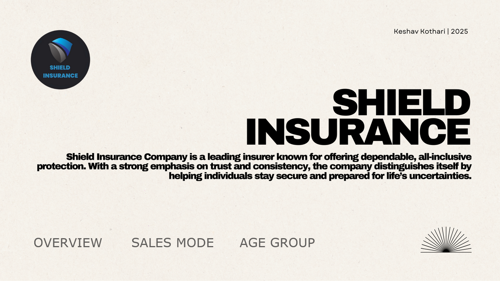
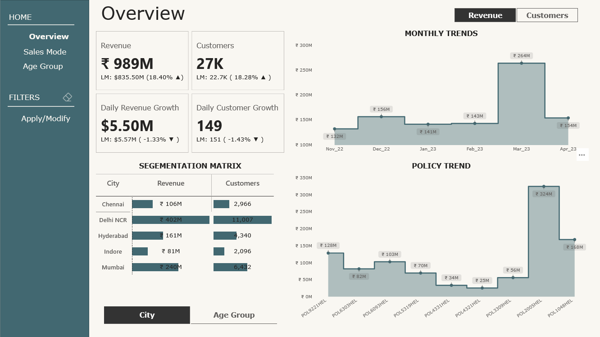

# 🛡️ Shield Insurance Power BI Dashboard



## 🔍 Overview

**Shield Insurance** is a fictional insurance provider for which this interactive Power BI dashboard was developed. The dashboard analyzes the company’s performance across multiple dimensions including:

- Revenue & Customer Trends
- Age Group Segmentation
- Sales Channel Effectiveness
- Policy-wise Revenue Distribution
- Monthly Trends & Settlement Percentages

📊 This project demonstrates how Business Intelligence tools like Power BI can bring clarity to business operations and enable data-driven decisions.

> 🔗 **[Live Dashboard Link →](https://app.powerbi.com/view?r=eyJrIjoiNjRhNWYzOWMtNGQyMi00YmQyLTgwNDgtYjM4Njk2M2VmYzg3IiwidCI6ImM2ZTU0OWIzLTVmNDUtNDAzMi1hYWU5LWQ0MjQ0ZGM1YjJjNCJ9)**  
> *(hosted on Power BI Service)*

---

## 🧭 Navigation Structure

- **Home**: Project introduction & navigation
- **Overview**: High-level KPIs & city segmentation
- **Sales Mode**: Channel-wise revenue/customer trends
- **Age Group**: Segment-wise behavior & settlement analysis
- **Filters**: Interact by city, age, sales mode, etc.

---

## 📌 Key Features

### 📊 Overview Dashboard



- **Total Revenue**: ₹989M
- **Customers**: 27K
- **Daily Growth**: $5.5M (Revenue), 149 (Customers)
- **Top City**: Delhi NCR with ₹402M & 11,007 customers
- **Revenue Peak**: March 2023

---

### 🧾 Sales Mode Analysis


- **Offline-Agent** dominates with ₹551M (56%+)
- Online channels pick up momentum in March
- Policy-wise breakdown by each mode (Agent, Direct, App, Website)
- Sales Mode Trends over 6 months

---

### 👥 Age Group Analysis


- **Settlement %** increases with age — **71.12% for 65+**
- **Highest Revenue**: 31–50 age group
- **Policy POL2005HEL**: ₹122M from 65+ age group
- **March 2023 Peak**: 41–50 group drove ₹93M in revenue

---

### 🎯 Filters for Exploration

Custom filters allow users to:
- Slice data by Age Group
- Drill down by Sales Mode
- Compare cities
- Focus on specific policies or months

---

## 🛠️ Tools Used

| Tool          | Purpose                                      |
|---------------|----------------------------------------------|
| Power BI      | Data modeling, DAX, dashboard development    |
| Power Query   | Data transformation and cleansing            |
| DAX           | Calculated fields, measures, and KPIs        |
| Excel/CSV     | Data source input                            |

---

## 💡 Key Insights

- 🧓 Older age groups (51–64, 65+) show **higher settlement rates**, suggesting stronger claim handling and service reliability — though this doesn’t necessarily mean higher revenue.
- 💰 The **31–50 age group** is the most revenue-generating demographic.
- 🧾 **Policy `POL2005HEL`** is the most preferred, especially by the 65+ group, showing product-market fit for senior citizens.
- 🏙️ **Delhi NCR** leads across both revenue and customer base, followed by Mumbai and Hyderabad.
- 🌐 **Online channels**, particularly **Online App and Website**, gained traction in March — possibly due to targeted marketing campaigns or seasonal behavior.

---

## 📁 Repository Structure

```plaintext
/Shield-Insurance-PBI
│
├── Home.png
├── Overview.png
├── Sales Mode.png
├── Age Group.png
├── Shield_Insurance_Report.pbix (optional if added)
└── README.md
